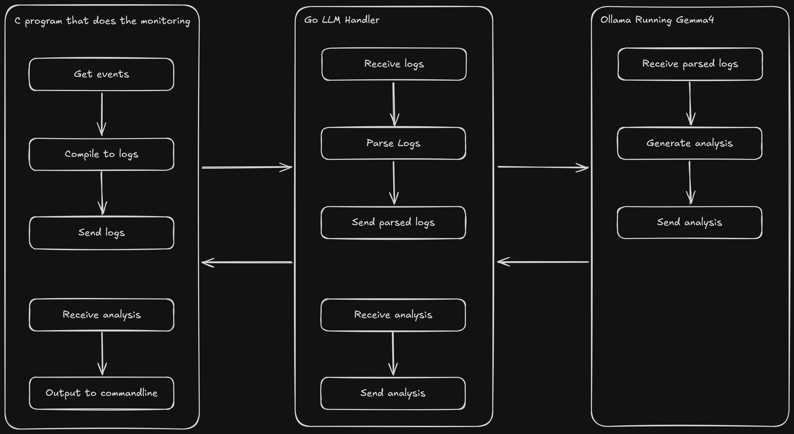

# macOS Security Log Analyzer
An AI based process monitor for Macs that analyzes running processes on your machine as well as startup scripts and background processes and looks for any suspicious behavior.

## Architecture


## Endpoint Security monitor

The Endpoint Security client entitlement is a restricted entitlement. A binary that includes
`com.apple.developer.endpoint-security.client` must be signed with a provisioning profile that
also contains that entitlement. If the profile is missing, macOS kills the process before `main()`
runs and logs messages like:

```text
Disallowing SecurityAnalyzer because no eligible provisioning profiles found
Restricted entitlements not validated
AMFI: bailing out because of restricted entitlements
```

Build the monitor as an app-like bundle so the provisioning profile can be embedded:

```sh
cd /path/to/macOS-security-log-analyzer
chmod +x monitor/scripts/build-es-app.sh
PROFILE=/path/to/YourEndpointSecurityProfile.provisionprofile \
IDENTITY="Apple Development: Your Name (TEAMID)" \
BUNDLE_ID="com.example.security-analyzer" \
monitor/scripts/build-es-app.sh
sudo monitor/out/SecurityAnalyzer.app/Contents/MacOS/SecurityAnalyzer
```

The profile must be created from an Apple Developer account that has been granted the Endpoint
Security entitlement, and the profile's bundle identifier must match `BUNDLE_ID`.

To inspect a profile before using it:

```sh
security cms -D -i /path/to/YourEndpointSecurityProfile.provisionprofile > /tmp/es-profile.plist
/usr/libexec/PlistBuddy -c 'Print :Entitlements:com.apple.developer.endpoint-security.client' /tmp/es-profile.plist
```
